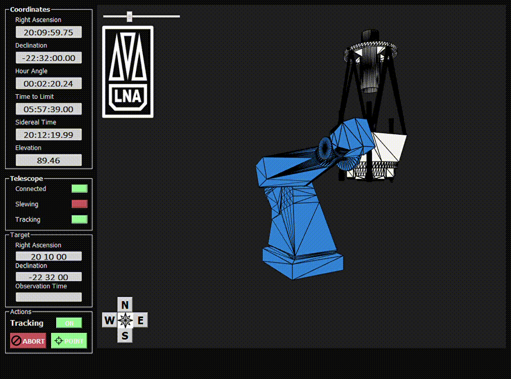

<h1 align="center">Simulator for Pico dos dias Observatory Telescops</h1>
<h3 align="center">Pico dos dias Observatory</h3>

<h3>Availble models</h3>
<ul>
    <li>Perkin-Elmer 1.6m (Equatorial mount)</li>
    <li>Boller & Chivens 0.6m (Equatorial mount)</li>
    <li>Asa 80cm (Fork Alt-Az mount)</li>
    <li>Robotic 40cm (German-Equatorial mount)</li>
</ul>

<b>IMPORTANT:</b> Make sure to switch mount type on the ASCOM simulator

### Requirements
<ul>
    <li>Python 3</li>
    <li>ASCOM Platform 6+</li>
</ul> 
### Images

